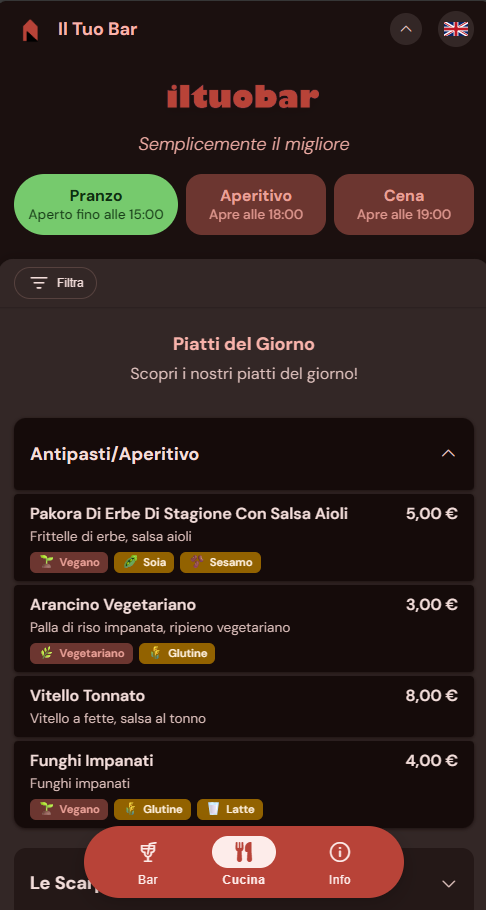
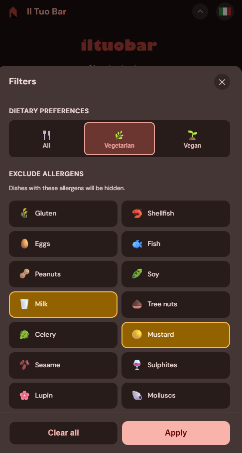
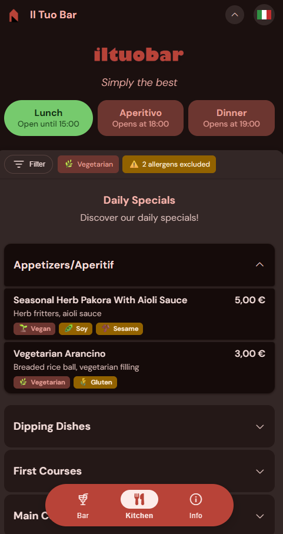
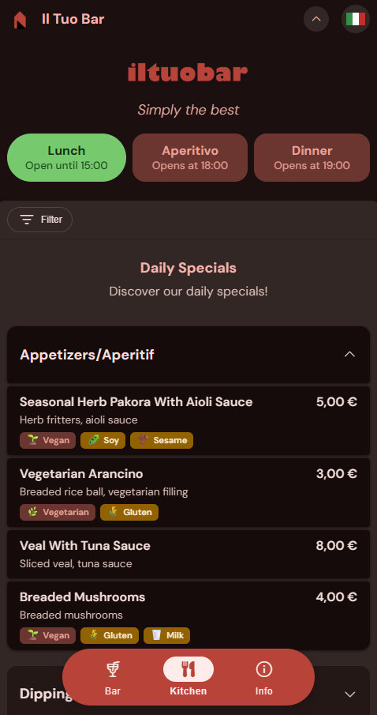
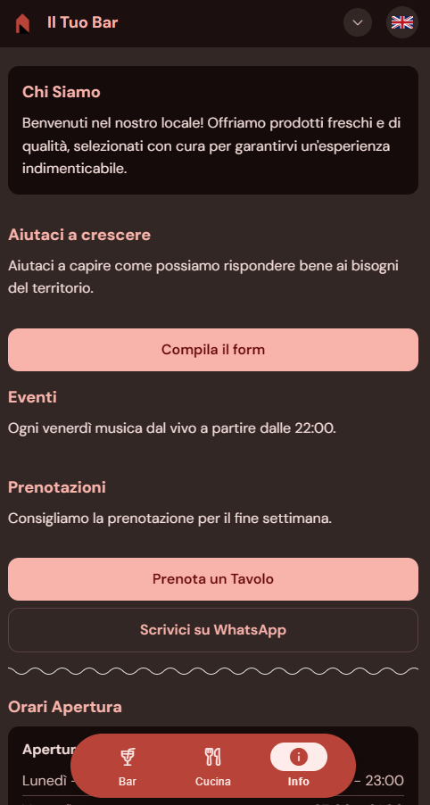
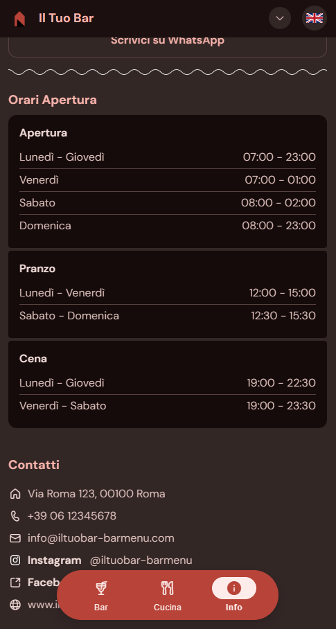

# Easy Bar Menu

A modern, mobile-first digital menu application for bars and restaurants. Powered by Google Sheets for easy content management.

  
*Screenshot of the home page of the Menu*

---

## Quick Start

1. **Copy the Template**: [Open the Google Sheets template](https://docs.google.com/spreadsheets/d/15OwloYGgx9OTKt9dtR9erWvJbgVeTTwtxUuiM92e75E/edit?usp=sharing) and save a copy to your Google Drive

2. **Edit Your Menu**: Update the spreadsheet with your menu items, opening hours, and content. For detailed instructions, see [Google Sheets Setup Guide](docs/GOOGLE_SHEETS_SETUP.md)

3. **Publish as CSV**: In Google Sheets, go to File > Share > Publish to web, select CSV format, and copy the URL

4. **Clone the repository**: Clone the current repository to your machine

5. **Configuration**: Edit the `config/config.json` file to reflect your brand identity and paste the CSV URL:
   ```json
   {
     "inputData": {
       "menuUrl": "YOUR_GOOGLE_SHEETS_CSV_URL_HERE"
     }
   }
   ```

6. **Theming and SEO**: Execute the scripts, if needed.
   ```bash
   npm run generate-theme
   npm run build-pages
   npm run build-index
   npm run build-seo
   ```

7. **Deploy**: Upload to GitHub Pages, Netlify, or any static hosting service


---

## Key Features

### Mobile-First Design
Responsive interface optimized for smartphones with Material Design 3 aesthetics.

### Multilanguage Support
Native Italian and English support with instant language switching.

### Easy Content Management
Update your menu through Google Sheets - no coding or deployment required.

  
*Example of the unified Google Sheets structure with multiple tables side by side*

### Allergen Tracking & Diet Filters
Complete support for all 14 EU-regulated allergens with filtering capabilities. Filter menu items by Vegetarian and Vegan preferences. Additionally, you can display the availability of dairy-free and gluten-free product variants.


  
*Allergen and diet filters*

  
*Menu with allergen and diet filters applied*

### Kitchen Status Display
Real-time kitchen availability based on configured time slots.

  
*Placeholder: Kitchen status cards*

### Zero Backend
Pure static site - works on any hosting service with no server required.

---

## Documentation

- [Google Sheets Setup](docs/GOOGLE_SHEETS_SETUP.md) - Complete guide to setting up your data source
- [Data Structure Reference](docs/DATA_STRUCTURE.md) - CSV table structure and column specifications
- [Configuration Guide](docs/CONFIGURATION.md) - Complete `config.json` reference
- [Customization Guide](docs/CUSTOMIZATION.md) - Theming, styling, and advanced customization

---

## Installation

### Prerequisites
- Node.js (for build scripts only)
- Google account (for Google Sheets)

### Local Development

```bash
# Clone the repository
git clone https://github.com/zorzlu/Easy Bar Menu.git
cd Easy Bar Menu

# Install dependencies
npm install

# Run local server
npx serve -l 3456

# Open browser to http://localhost:3456
```

### Build Commands

```bash
npm run generate-theme  # Generate color theme
npm run build-pages     # Build static pages
npm run build-index     # Build index.html
npm run build-seo       # Generate sitemap and robots.txt
npm run build           # Run all build scripts
```

---

## Deployment

### GitHub Pages

1. Push to GitHub
2. Settings > Pages > Select branch > Save
3. Access at `https://username.github.io/easy-menu`

### Netlify / Vercel

Drag and drop the project folder or connect your GitHub repository.

---

## Screenshots

  
*Menu categories and items*

  
*Info page with custom content*

  
*Info page with opening hours and contact*

---

## Technology Stack

- HTML5 / CSS3 / JavaScript (ES6+)
- Material Design 3 color system
- Google Sheets API (CSV export)
- No frameworks or build tools required for runtime

---

## Contributing

Contributions are welcome! Please feel free to submit issues and pull requests.

---

## License

This project is licensed under the Apache License 2.0.  
See [LICENSE](LICENSE) file for details.

---

## Support

- Documentation: [docs/](docs/)
- Issues: [GitHub Issues](https://github.com/zorzlu/Easy Bar Menu/issues)
- Template: [Google Sheets Template](YOUR_GOOGLE_SHEETS_TEMPLATE_LINK_HERE)
